<h1>DON'T PANIC - DOCUMENTATION </h1>

<h2>Table of content</h2>
<dl>
  <dt><a href="#one">THE CONCEPT</a></dt>
  <dt><a href="#two">LLL FRAMEWORK</a></dt>
  <dt><a href="#three">The articles and the typographical styles</a></dt>
  <dt><a href="#four">The metadata</a></dt>
  <dt><a href="#five">The Articles Markup</a></dt>
  <dt><a href="#six">TYPOGRAPHIC STYLES</a></dt>
    <dd><a href="#seven">1300</a></dd>
    <dd><a href="#eight">1800</a></dd>
    <dd><a href="#nine">1930 - Futurism</a></dd>
    <dd><a href="#ten">1980 - Modern graphic design</a></dd>
    <dd><a href="#eleven">2000 - Youngsters Magazines</a></dd>
    <dd><a href="#twelve">The Future - A Futuristic Melting Pot</a></dd>
</dl>

<h2 id="one">THE CONCEPT</h2>

‘’Don’t panic, Earth issue’’ is a magazine inspired by the ‘’Hitchhikers Guide for the galaxy’’ world. The Guide was originally conceived by Douglas Adams in 1978 as a BBC radio comedy, and then published as “a trilogy in five parts” from 1979 to 1992 and inspired films, tv series and other formats, all sharing the same comedy-sci-fi-surrealistic approach. The Guide also inspired festivities such as the Towel Day (4/2) and a significant amount of inside jokes. 

The themes and tones of this website are borrowed from the book, publishing articles from the real world with the critical point of view of the fictional opera. 

The title and the scenario behind the magazine take inspiration from the destruction of Earth happening in the novel: we used this as a starting point for imagining the publication of a collection of articles covering earthly issues from intergalactic publishers, namely “Deep Thoughts", “Magratears” and "Vogueon”. 

<ul>
 <li><b>Magratears</b> is an issue covered by the people of Magrathea, a planet devoted to luxury-planets design, where Earth was crafted and created, as a tribute for its forever lost wonders, which represent a great loss in the planet’s production portfolio;</li>
 <li><b>Deep thoughts’s</b> issue is covered by multidimensional beings (also known as lab rats) in the attempt to recollect the memory of the iper-computer Earth (our planet) and formulate the right question to which 42, the outcome provided by the super-computer Deep Thought to the fundamental question, could be a meaningful answer.The themes covered by this issue are the questions that we human (computer components built to formulate the question) ask ourselves regarding life and the universe , especially the ‘’most creative ones’’. </li>
 <li><b>VOGUEON </b>is an issue inspired by the Vogon race, which has the main characteristics of being very ugly, very attached to bureaucracy and able to develop the third worst poetry in the entire universe. The articles cover issues related to Earth poetry particularly appreciated by Vogon. </li>
</ul>

Since we are moving through the universe of the Guide, we are fueling our magazine with an Infinite Probability Drive. That said we could be anywhere in space and time simultaneously, and that is why readers will have the chance to move in the time lenses offered by the website and observe different moments of Earth’s history. 

  
<h2 id="two">LLL FRAMEWORK</h2> 

The purpose of this website is to display 3 different issues, each containing three articles, to be visualized side by side or one at a time.
  

We have two main aims: the first is to visualize the website and display the different articles through the lens of historical typographical layouts, while the latter is to allow users to compare metadata relative to their content. 
 

The general idea behind the resource is to allow a simultaneous visualization and discovery of the articles, easing the comparation of their content and providing the user a journey through the lenses of typography. 

  
<h2 id="three">The articles and the typographical styles </h2>

In order to allow such exploration, we implemented an AJAX structure: the articles are in fact .txt files that, following the request of the user, are fetched in the page and positioned in a structure from 1 to 3 columns wide. The columns are a total of 6 (1 +2 +3) and, depending on how many articles need to be visualized simultaneously the div containing the right number of columns is displayed while the other two are “hidden”: each article is independently scrollable and issues can be switched in any given moment maintaining the number of articles displayed unchanged. Also, the sources of the articles are instantiated in the sidebar next to the titles. To achieve so we used a JSON file containing the .txt files names, the titles of the articles and their sources. 
 

A script to switch between different stylesheets (in the number of six) has also been created, which, without reloading the page, adds the script corresponding to the selected CSS below the predefined style, applying in this way the "lens” to the page. Lenses are also portable from one page to another, meaning they will last as long as the user does not change them. 

  
<h2 id="four">The metadata </h2>

The articles metadata are also displayed using Javascript and JQuery.
  

Once the articles are fetched in the page a script is run: first it selects directly from the text the general metadata relative to every article (author, date of publication, etc...) and then, the same function, proceeds to search in the text for the issue-specific metadata. This has been obtained by a previous metadatation of concepts of interest directly in the HTML of the text. The whole structure was tought to allow a fast and functional addition of issues\articles simply by being compliant to the metadatation standard and adding the proper records to the JSON file. 

 
<h2 id="five">The Articles Markup</h2>

The markup of the articles followed our specific needs for the project. First, we marked-up the structural components of the documents, such as titles and paragraphs, referring more to the visualization needs than to the contents, and paying attention to the elements that would show particular needs for the different typographical styles. 

We then added semantic markup, in order to highlight the metadata present in the text and make them easily extractable. Each metadata relies inside a span and carries his own id, a class "mention” followed by his specific identifier class, an attribute about and a data-label, which are of particular importance for "concepts”.
  

The classification for the metadata works with 5 main categories (Places, People, Concepts, Dates and Organizations) 4 of which are the same within the issues, while the subclasses of the Concepts categories will be treated differently for each issue, to support a higher precision in research and comparison. 
 
  
The organization is the following: 

 <ul>
  <li><b>Places</b> are identified within the tag <conde> &#60;span id="ID" class="mention place" about="SIGNIFICANT NAME " data-label="DISPLAYED NAME" data-wikidata-id="WIKIDATA IDENTIFIER">Earth&#60;/span> </code> </li>
  <li><b>Concepts</b> are identified differently from issue to issue </li>
  <li><b>Organizations</b> are identified within the tag:  <code>&#60;span class="credit">&#60;span id="ID" class="mention organization" about="ORGANIZATION NAME" data-label="DISPLAYED NAME">Getty Images &#60;/span>&#60;/span> </code> </li>
  <li><b>People</b> are identified within the tag: <code>&#60;span id="ID" class="mention person" about="PERSON NAME" data-label="DISPLAYED NAME ">Michael Marshall&#60;/span> </code></li>
  <li><b>Dates</b> are identified within the tag: <code>&#60;span id="ID" class="mention date" about="DATE" data-label="DISPLAYED DATE">2013&#60;/span></code></li>
  </ul>

For what regards Concepts, the attribute about serves as a wider categorization, while the data-label carries the specific information about the meaning of the metadata. For example, in the Deep Thoughts issue we can find, among others: 

<ol>
 <li><b>Scientifically and Not Scientifically Supported Theories:</b><code> &#60;span id="ID" class="mention concept" about="theories" data-label="Hollow Earth">hollow earth belief&#60;/span> </code> </li>
 <li><b>Ideas Belonging to Theories:</b> <code> &#60;span id="ID" class="mention concept" about="ideas" data-label="Bible ">the world is 6,000 years old and created in seven days as for the Bible&#60;/span> </code></li>
  </ol>

This serves just as an example of the logic applied to Concepts categorization: reporting the whole structure implied for every issue here will be useless since we worked towards the use of self-explanatory conceptualizations.
 

<h1 id="six">TYPOGRAPHIC STYLES</h1>
  
<h2 id="seven">1300 - Illuminated Manuscript</h2> 
<h3>Background</h3>

During the Middle Ages sharing and recording written text was a long and complex task. Most written texts where kept in the Monasteries, they were contained into codices, books made of parchment (more rarely vellum or papyrus) pressed between stiff boards. 

The only way to obtain a copy of a manuscript was to copy the original by hand: monks would travel to distant monasteries to obtain a new volume to be reproduced for their own monastery’s library. 

Many hands worked on the same codex with different duties, scribes would reproduce the text, leaving space for rubrication, marginalia and miniatures, often done by other copyists and artists. 

Rubrication was the usance of adding text in red ink for emphasis, it was usually done to mark important text, such as headings, the start of a new paragraph, or other division of a text; it was often important since no space was left between paragraphs or even different works bound in the same volume. 

Miniatures were small illustrations painted with colorful inks and often the addition of golden details to enrich the manuscripts, they were applied at the margins of the page or to decorate the initial letter of a paragraph. 

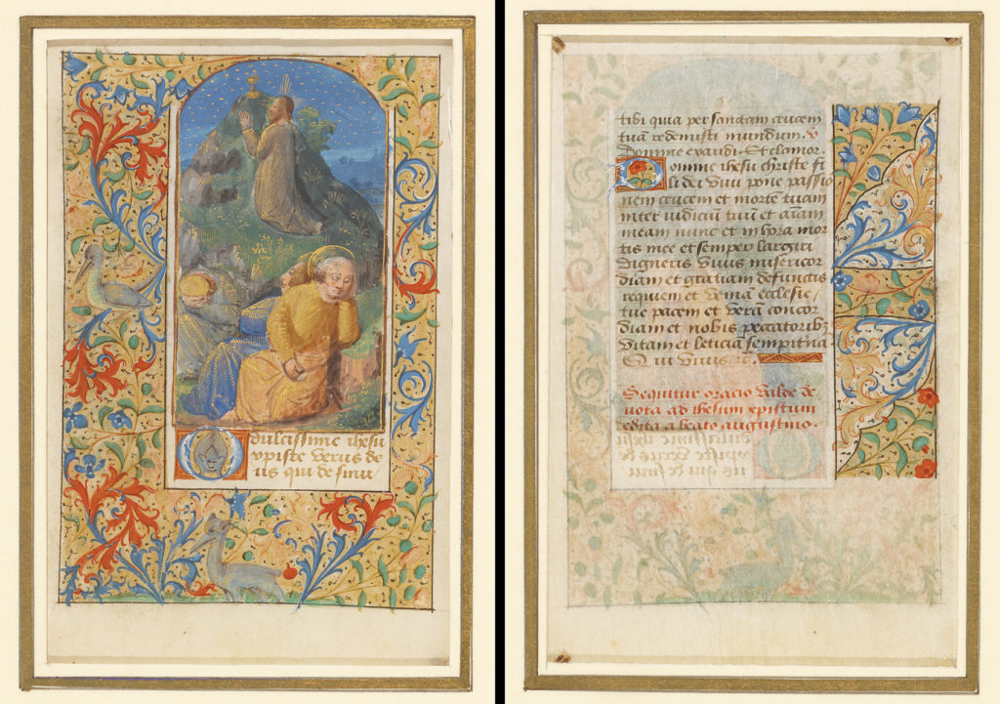
<h3>Layout</h3>

We wanted to recreate the idea of a precious illuminated manuscript. 

On the page dedicated to the article display we used a filter to recreate the effect of parchment. 

We deleted most of the spacing between paragraphs and headers and used wide margins to recreate the dense and continuous text paragraph interrupted only by rubrics that we found in most manuscripts. 

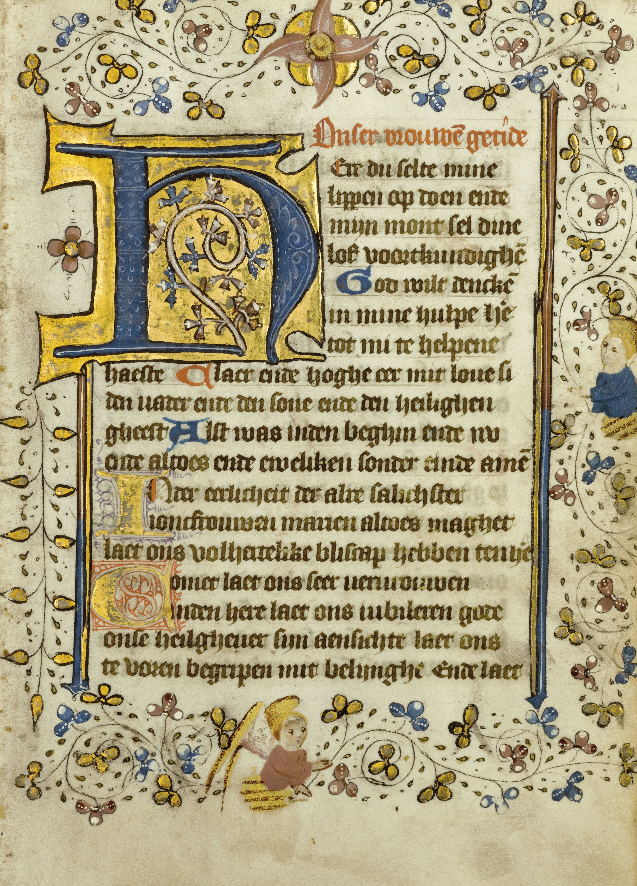 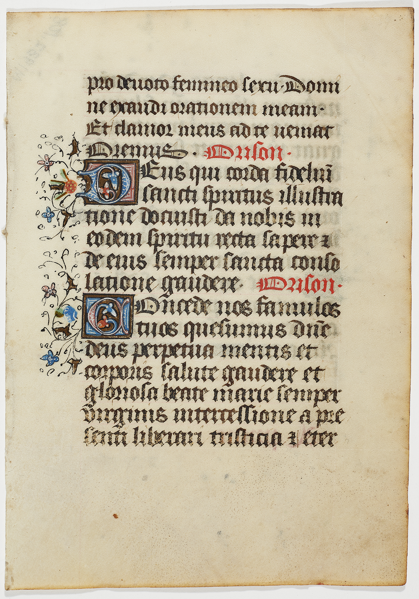

We applied two fonts to the entire body of text: Candlebright that is very similar to Textura, the kid of script used in manuscripts from the 10th to 17th century throughout western Europe; and Camelot used for drop-caps exclusively on the first letter of headers and at the start of paragraphs to emulate the elaborate illuminated letters found in codices. 

The headers of the articles are colored in red in to reproduce rubrics, and on the cover page the icon in used to suggest a small miniature. 

We gave particular attention to the page layout and used a different text disposition depending on the number of issue’s articles showed on the page:
In an open codex the text is pushed upward and toward the center of the pages by small gutters and wide margin below and aside. 

We recreated this layout when two article are shown aside, and displaying the text in two column when a single article is shown, while we decided to maintain a smaller margin when three articles are shown to not impair readability. 

<h3>Colours</h3>

To reproduce the vibrant colours of miniatures we choose a palette of gold and blues for the archives and the menus, dark red for the article headers, and used images of original miniatures for the archive pages. 

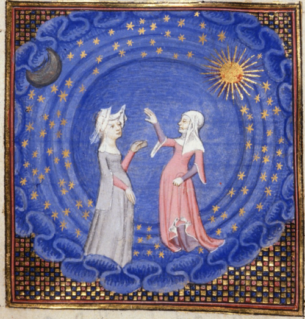 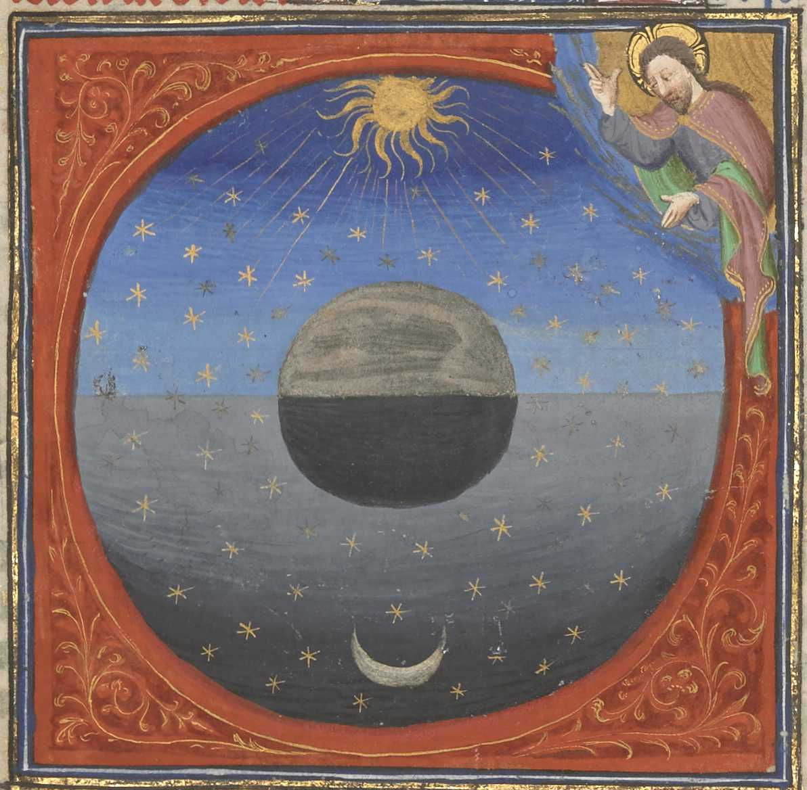

<h2 id="eight">1800 - Dayly Newspaper</h2> 

<h3>Background</h3>

The 19th century was an age of great changes and revolutions. 

In the troubled political climate, where new nations where formed, consolidated empires like The British and the Russian empires secured and expanded their power over colonies. 

Many social changes took place: Slavery was abolished. The First and Second Industrial Revolutions led to massive urbanization and much higher levels of productivity, profit and prosperity. 

To different degrees manufacturing spread across Europe turning the continent into the world centre of industrialisation, finance and commerce. New technical innovations initiated industrial progress with steam power driving the development of heavy industry. Methods of production were totally transformed and large factories with thousands of workers mass produced industrial and consumer goods. 

Speed, dynamism and a belief in progress defined Europe by the end of the 19th century. Railways, electricity, cinema, photography and new theories in science and medicine affirmed Europe’s leading role in this technological coming of age. 

During this period the printing industry wasn’t immune to changes: the invention of the steam powered press, in 1812, made it possible to print over a thousand copies of a page per hour, this began to make newspapers available to a mass audience (which in turn helped spread literacy), and from the 1820s changed the nature of book production, forcing a greater standardization in titles and other metadata. 

The newspaper printed in this period are mass produced, characterized by large pages and a dense disposition of the text across multiple columns as they prioritized a fast and consistent production over the stylistic quality of the final product. 

<h3>Layout</h3>

To capture the spirit of a 19th century newspaper we took inspiration from The Times one of the most influential news outlets of the time, founded by John Walter in 1784 and still printed today. 

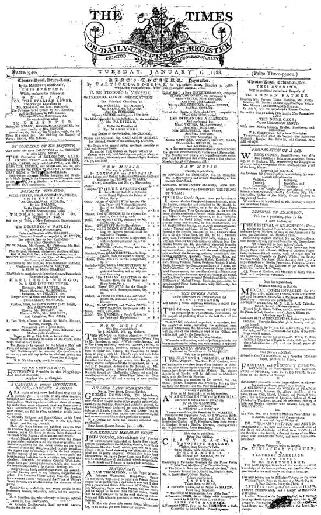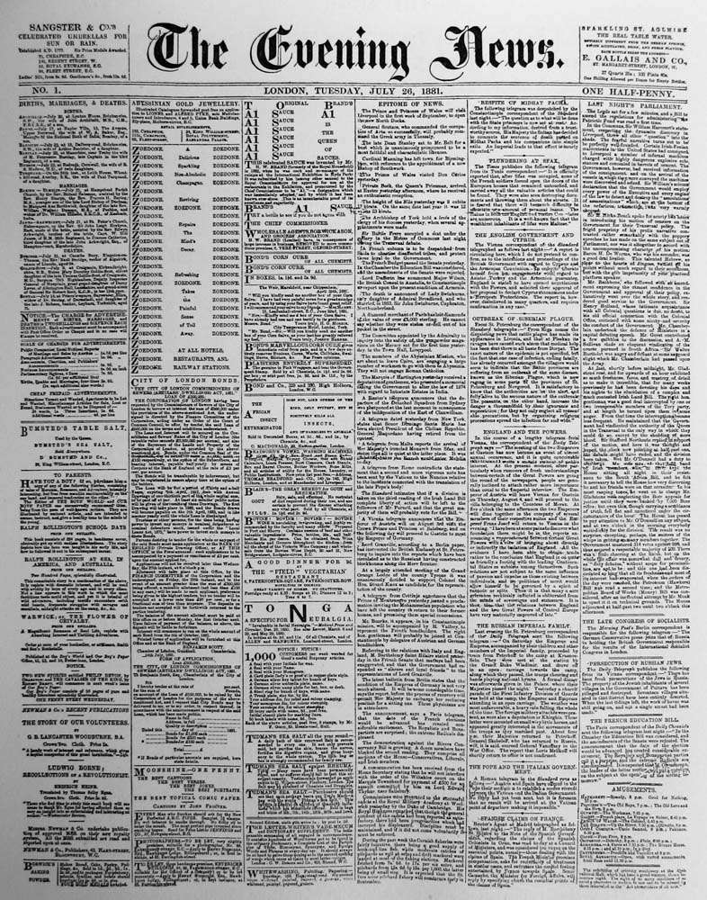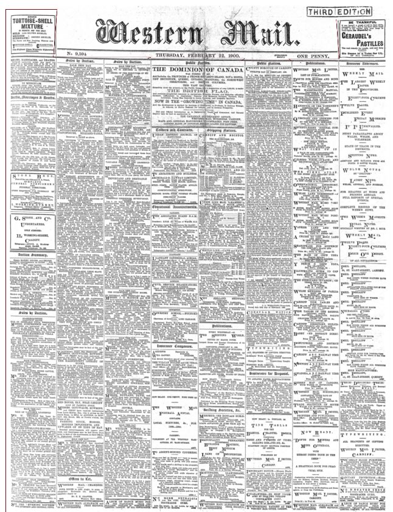

We choose Manuskript Gotish a decadent font for the headline that resembles Old English blackletters, very similar to the fonts used for most newspaper’s headers, and a more modest serifed font for the the article headers: Opulence. 

Of course, for the text body we used Times New Romans the most classic serif font and commissioned precisely by the Times. 

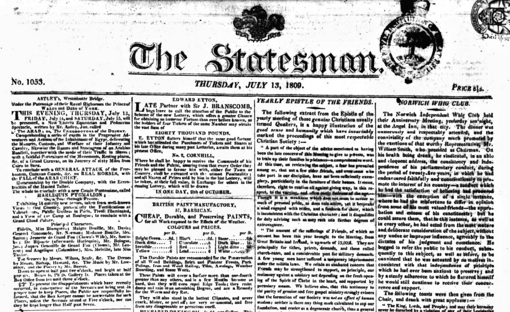     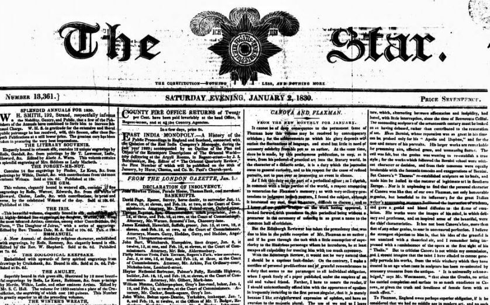

To reproduce the layout of the crowded newspaper’s pages we justified the text, kept a small line height, small margins, and divided the page in several columns (three or four depending on the number of articles visualized simultaneously). 

The coper page is inspired by the adds that started gaining ground at the time: vertical layout and an eye-catching illustration (in this case the web-page logo) 

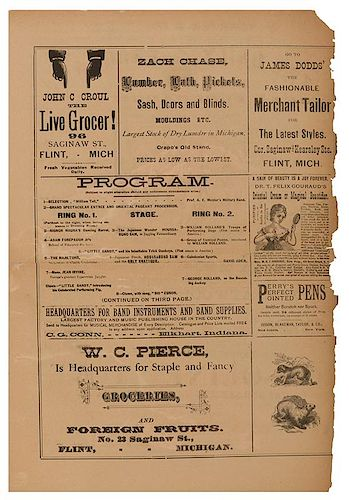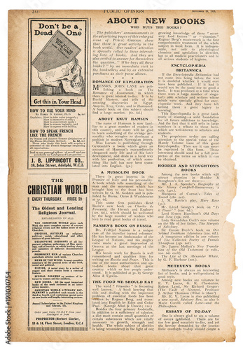

<h3>Colours</h3>

Finally, we kept the palette exclusively black and white and applied a filter to desaturate the pictures, while colored print was available in the late 1800, daily newspapers were optimized to be cheap and produced quickly and were usually colorless. 

 
<h2 id="nine">1930 - Futurism </h2>
<h3>Background </h3>

The 1930s was a fascinating era: on one side, there was great growth for culture, music, literature, and the arts; but on the other hand, it was a depressing time marked by unemployment, political turmoil, and the looming threats of WWII. There were also plenty of political movements, including the spread of populist ideas as well as the beginnings of World War II.
 

The futurism is from its first moment tendent towards the embracing of new experiences and innovations favored by technique improvement and technology development: new printing techniques such as the screen printing and spirit duplicator were introduced from the beginning of 1900’ and factory produced movable type gained popularity increasing publishing efficiency.
 

The periodic “ Futurismo”, which is not part of the clandestine phenomenon which diffused in that period in Italy, was first born in Rome in 1932 from the mind of Mino Somenzi, who was in touch with the futurist movement from 1913. The paper will stay in print until number 59 in 1933.
 

First born as a 15day periodic of 50x32, 12 pages each, from 1932 the format increases notably to 64x43 and the periodical starts to come out once a week.
 

The issues treated from the paper, ideologically close to the Futurist movement, included a wide variety of themes from architecture to theatre, from music to pedagogy and also poetry, cuisine and arts.
 

<h3>Layout</h3> 

For what regards fonts and typographical styles, in futurism we assist to a backlash of previous typographical styles, an increasing in popularity of sans-serif fonts and small variations in stroke heights.  The Futura sans-serif style, employed in the website for the article body, was created during that period (1927). Other fonts used in this style are all sans-serif and include the planet-n-compact and the PreussicheAusgabe, chosen for the similarity with the Futurism ones reported in the images below. 

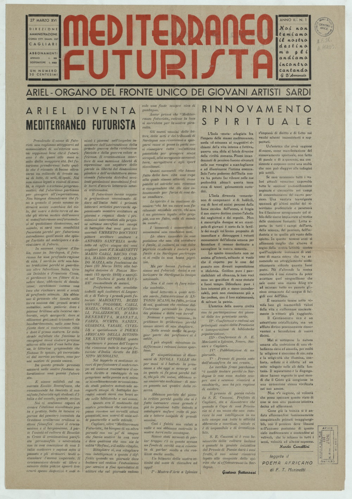     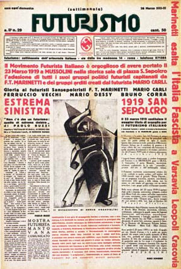     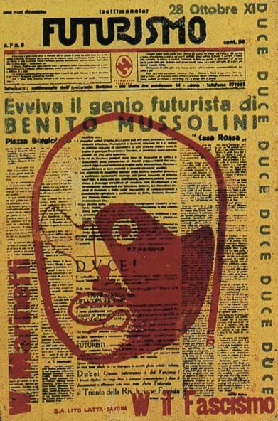     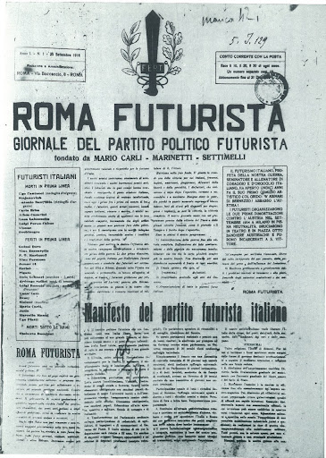

 

Also for the background of the page we decided to recall the Futurism artistic movements with two artworks, namely "Reaching the Sun” from Tullio Cralli and “The city that raises” from Umberto Boccioni: the first inspired the background colours while the second is recalled by the movement of the "stars". This choice was made in order to highlight the concept of movement and dynamism, central for Futurism, which we tried to obtain in the background of the page which is faster and more colorful than any other style.
 
 
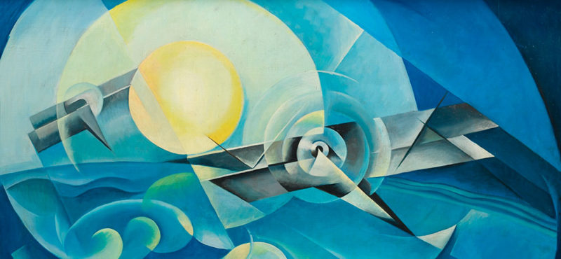

 <h3>Colours</h3> 

The main colours of this style are pure red, black and white, in order to replicate as close as possible the palette of Futurism's magazines. The background of the pages is realized in a smooth yellow, to recall the paper quality of the period. The background of the website takes the colours of Cralli’s artworks, with a gradient from yellow to white and then blue and a set of moving lines in the tones of Boccioni’s work. The images are here filtered with a grayscale, a contrast of 110% and a sepia of 50%.
 

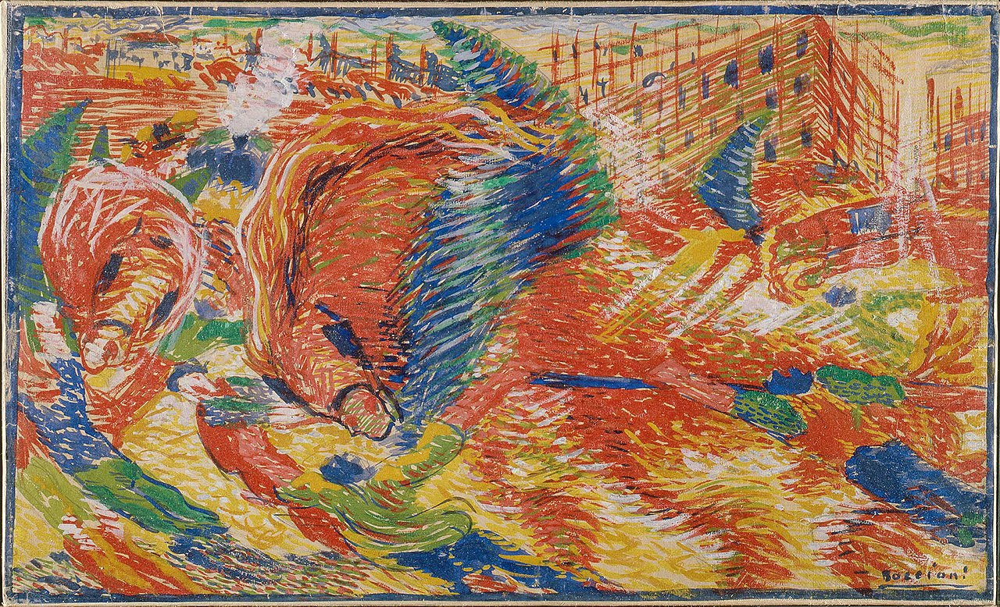
 
<h2 id="ten">1980 - Modern graphic design</h2>
 
<h3>Background</h3>

Graphic design in the 1980s marked the early beginnings of the digital revolution and the introduction of business and personal computers. As a result, there was an influx of technology in the development of graphics software. This new invention had a huge impact on graphic design. In this decade, the industry had changed forever.

It’s quite challenging to find authentic graphic designs that originated in the 1980s. So much of what’s on the Internet is actually current and only inspired by that decade. Carrying the brashness of ’70s graphic design over, graphic design in the 1980s is eye-catching. With its bold colours, jagged typography, and hair-raising styles, it was all about grabbing people’s attention.
 

Moreover, with the introduction of design software, graphic artists had the ability to create powerful images and easily manipulate layout, colour, and form. Graphic designers were freer to experiment and test new things. This led artists to steer away from earlier modern fonts. They created and mixed font families, weights, and sizes to create a jumbled, spontaneous feel. This “new wave” approach then led to the development of the Deconstructive Typology movement, which is characterised by nonlinear type that incorporates spatial layout.
 

As a result, graphic design in the 1980s was modern and cool. Designers had a distinct style. They used different geometric patterns, complementary color schemes, and technology to give their design a “futuristic” feel as people in the 1980s were future-inclined and wanted to depict what lay ahead.

 
<h3>Layout</h3> 
 

This stylesheet takes inspiration from Omni magazine, a science and science fiction magazine published between 1978 and 1995 in the United States and the United Kingdom. It contained articles on science, parapsychology and short works of science fiction and fantasy. Its design was characterised by letters and words in a bright color, often against a darker background, and the typical use both those years of a sans-serif fonts with more pronounced angles and curves.

For those motive we decide to use Artista-Pro font type, the free online available font similar to the Omni font, for the titles and Verdana font type, the one actually used by Omni magazine, for paragraph text.

The metadata menu viewer, archive and notice page are inspired by the magazine's back cover, white text on a black background. The style of the article layout is instead inspired by the minimalist but bold style of the revival articles, taking advantage of blocks of justified text and full columns interspersed with thick dividing lines.
 

The illustrations on the cards in the archive page of the website wants to remember the dreamlike and  comics environment in full Omni style. While the images are altered with blur and hue filters to simulate the palette used in the illustrations found on the Omni pages.

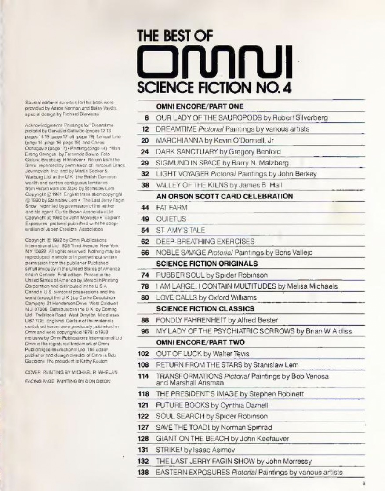 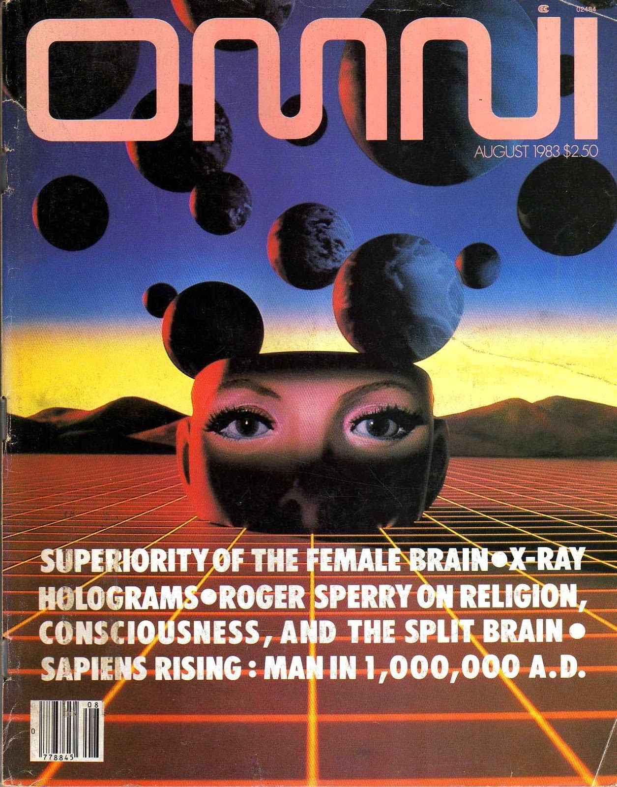 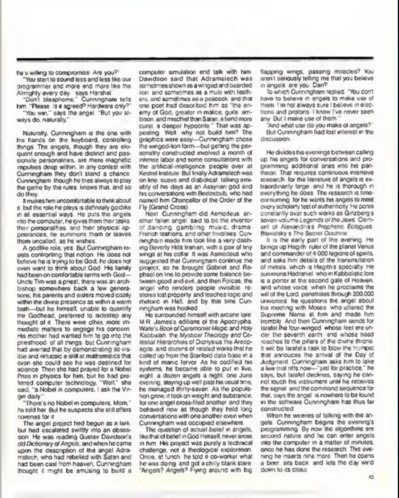
>>>>>>> 31427b0bda5a254a73e8a1ec59b6d89c7cf4171b

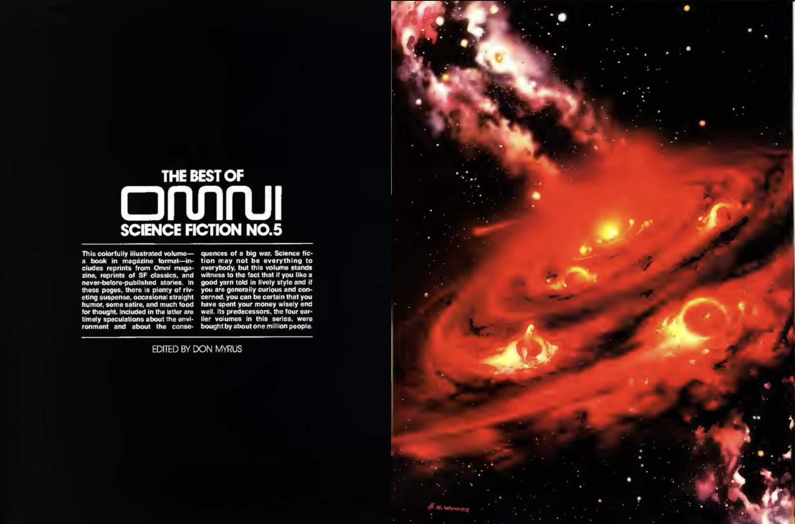 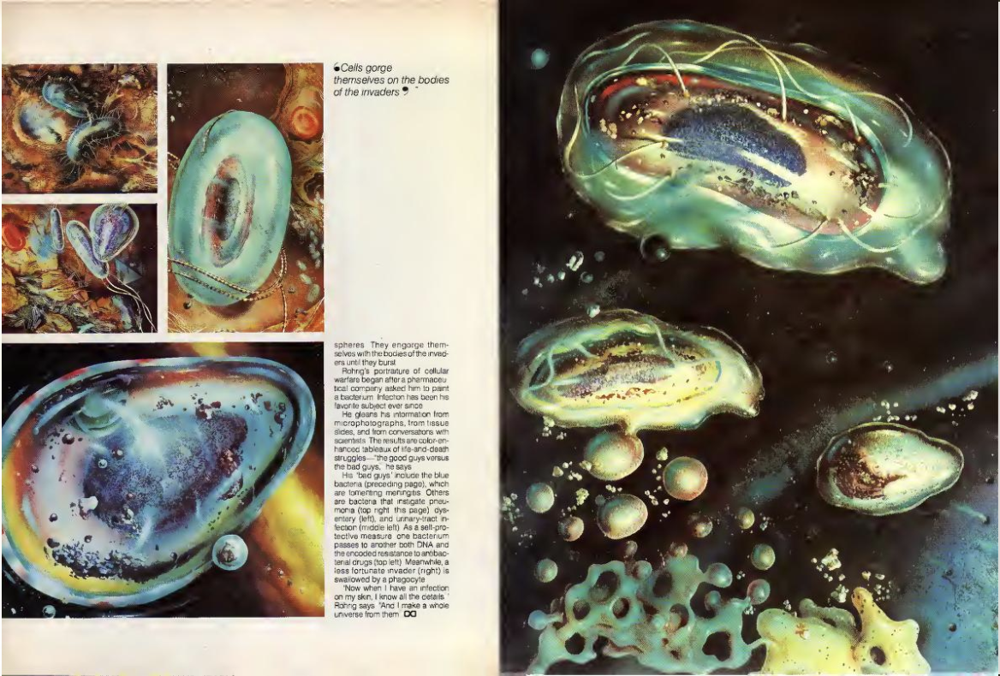

<h3>Colours</h3> 
 

The main colours of this style are black and white, in order to replicate as close as possible the palette of Omni magazines. The background of the pages is in bright white, to recall the paper industrial quality of the period. The background of the website takes the gradient from the iconic series ‘Pictorial Number One’ from the artist Rudolf Hausner published on the Omni 0.5 issue during the 1983.

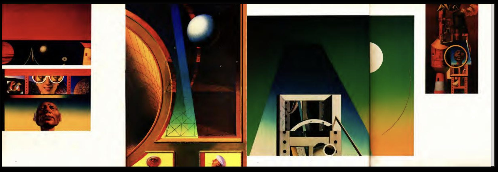

 
 <h2 id="eleven">2000 - Youngsters Magazines</h2> 
 <h3>Background</h3> 

The period spanning from 1990 to 2000 is clearly a flow, more than a breaking point signed by the turning of the millennium. The world is still experiencing economic growth and economies around the world are becoming more and more interconnected with a strong jump ahead in the globalization process. The invention of the WWW is finally blossoming into social networking and blogs, with the birth of Twitter and Facebook at the beginning of the century.
 

The popular culture of this period can be considered iconic for the fast switching in trends and the unpredictable growth and decade of icons: especially for young people, following the latest news and trends, magazines become a way to keep on track with their favorite celebrities before finally and inevitably switching to social medias. 
 
 <h3>Layout </h3>

For the 90s and early 2000s we took inspiration from Teen People, the youngsters version of "People” published from 1988 to 2006, and J-14 founded in 1998 which in 2007 was found to have been read from one American girl out of three from Experian Simmon Research, Florida. We chose to focus on the issues of 2000's.
 
 
 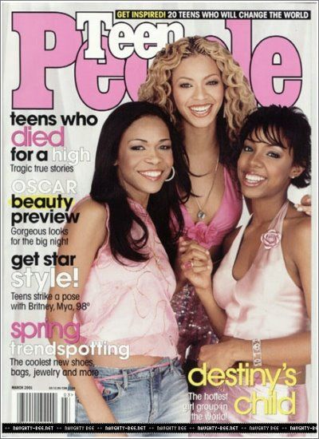     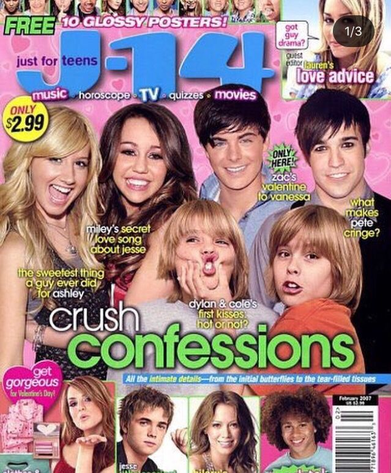 
 

We wanted to highlight the sparkling and colorful side of early 2000's publication, focusing on pink and purple shades that were particularly diffused in magazines devoted to teens, nonetheless sticking to the faint tint of fashion magazines paper for the articles background.
 
 
  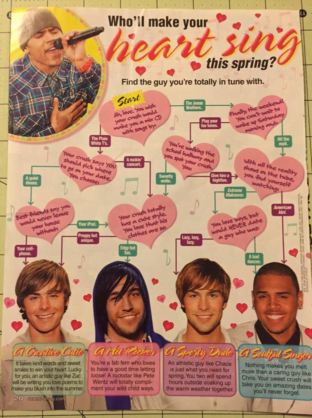     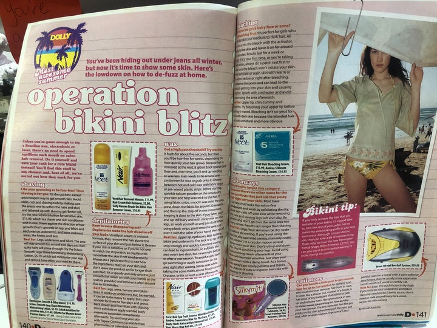 
 

The titles of the articles are in lowercase, to recall the typographical style of the magazines of the period. The font used for the title is the same as the one employed by “Teen People” and is called Egyptienne. For the subtitles we used Ginger, a font particularly used in the 2000, a typical Swiss sans serif, with a twirky geometric twist.

The text uses Faustina fonts in bold, regular and italic variations for different sections (e.g. text, captions and emphasized parts): Faustina was designed by Alfonso Garcia for editorial typography (books, newspapers and magazines) in print and online and is a serif font. 

The body of the articles is displayed in 1, 2 or 3 columns, depending on the number of articles on the page, to recall the pagination of the magazines themselves.
 
 
 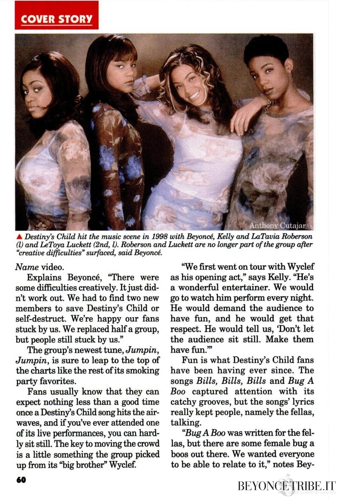   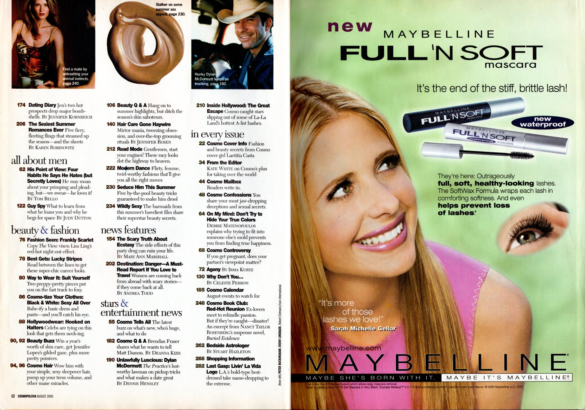
 
 <h3>Colours</h3> 

The colours chosen for this style are meant to recall the pagination of teen magazines, with a particular hint for press devoted to young girls. We chose colours from the pink and purple palette, with a splash of "sugar paper” blu and black and white for titles and paragraphs. The articles background color is meant to recall the paper tone of such magazines. The images are also filtered with a brightness of 135%, a contrast of 90% and a saturation of 120% to reflect the style of the period.
 
 
 <h2 id="twelve">The Future - A Futuristic Melting Pot</h2>
 
 <h3>Background</h3>
 
What’s more futuristic than the temporal end of the Universe itself? Easy, Milliways! 

As explained in ‘’Hitchhikers Guide for the galaxy’’, Milliways is a restaurant placed just a millisecond before the end of everything. As we know it, it offers just before the dessert a first-row seat for the Gnab Gib, the ultimate fate of the universe, consisting of a Big Bang in reverse. 
 

The restaurant building resembles a giant glittering starfish and is described as an intergalactic diner, situated at the end of time and matter: it has some of the most extravagant décor ever seen and serves a particularly good Pan Galactic Gargle Blaster. 

 
<h3>Layout</h3> 

We decided to develop our stylesheet following the above scenario: a user would expect from the end of the universe something like a futuristic menu, with neon colours, smooth angles and glittering, visible elements in the page. 

Probably plagiarised by the futuristic visual background of recent years, there are clear references to the Modern design of the 80s, the Cobol and the Matrix style of the 90s, Material design and, last but not least, the Vapour Wave that has characterised the social media graphic style of the last few years.

This mix results in glitched images ultra saturated, smoothed boxes rounded by a green neon. Logo and buttons remembering the fast food’s style in the futuristic cartoon "The Jetsons". A font for the titles that recalls the neon ones of the 80s. Paragraphs fill by bright green, justified on the left and free to float into space.

At the end, over use of animations in this stylesheet wants to underline the visual bombardment that characterises today's internet and that, probably in a different and less naive way, will be the predominant atmosphere of the much talked “Metaverse".

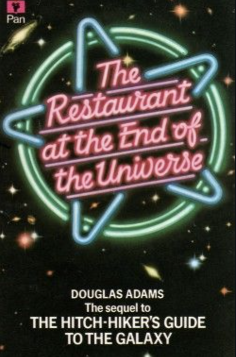 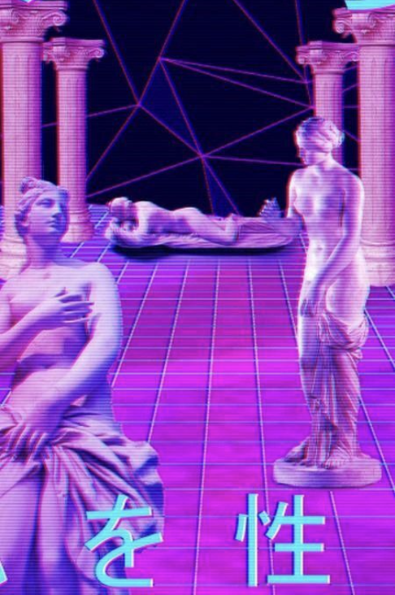 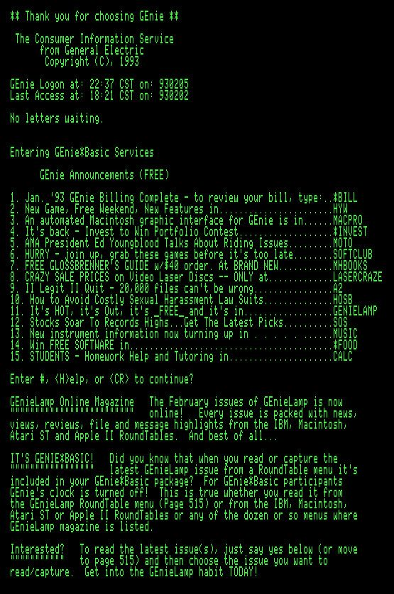 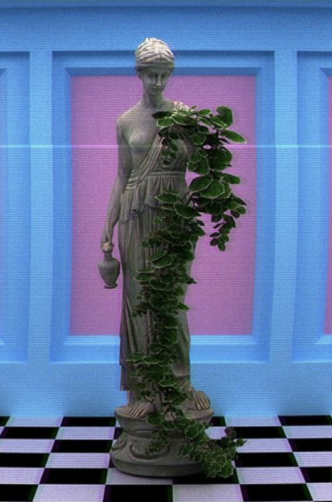

 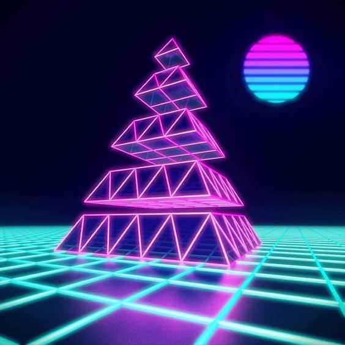

<h3>Colours</h3> 
 

 The main colours of this style are blue jeans, light blue, green and bright pink. All proposed in gradient, neon and glitch variants. Excessive saturations and dark but never solid background want to recreate a mix of styles ranging from retro to science-fiction, without neglecting web and programming culture.

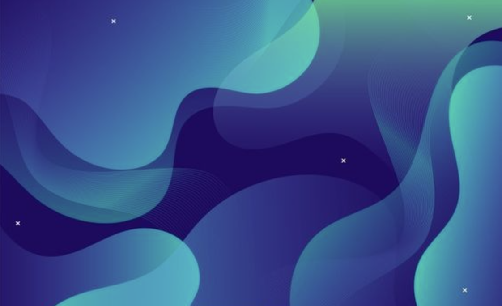
